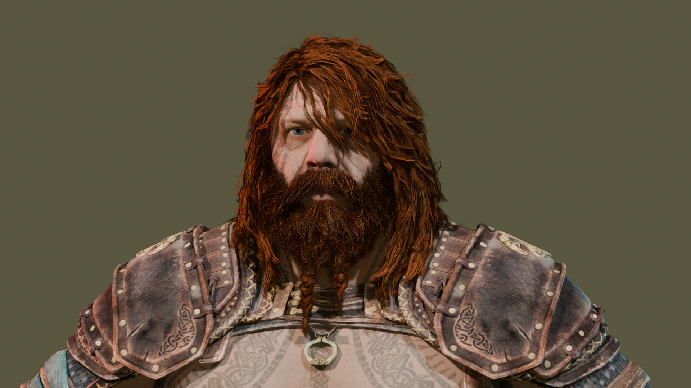

# BlenderArt

This is an archive of all my experiences while learning Blender

## Animations Folder

This contains gifs and videos of all the animations I ported into Blender

## RegularBackground Folder

This contains all the renders that were made with a simple colorful background

These renders were made with the purpose of testing out my posing and lighting skills, so I didn't bother with a background.

## ScenicRenders Folder

This contains all the renders that include a complete scenery and background

These were much harder to make since I had to build the background along with the characters, making sure the lighting and shadows looked semi-realistic.    

This was also a chore for my computer, since my custom Blender build has built-in Ray Tracing, which had my integrated GPU fighting for it's life.

## WIPs Folder

This folder contains renders that were either not finished or were just used to test new models.

