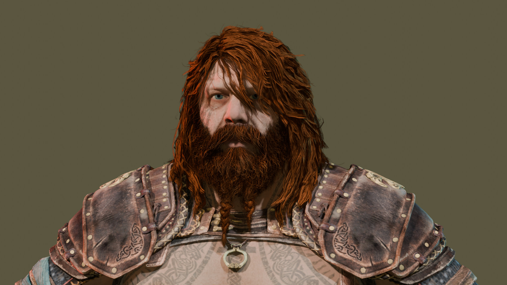

# BlenderArt

This is an archive of all my experiences while learning Blender

## Animations Folder

This contains gifs and videos of all the animations I ported into Blender

## RegularBackground Folder

This contains all the renders that were made with a simple colorful background

## ScenicRenders Folder

This contains all the renders that include a more complex background, or a sort of backdrop image.

   

## WIPs Folder

This folder contains renders that were either not finished or were just used to test new models.

